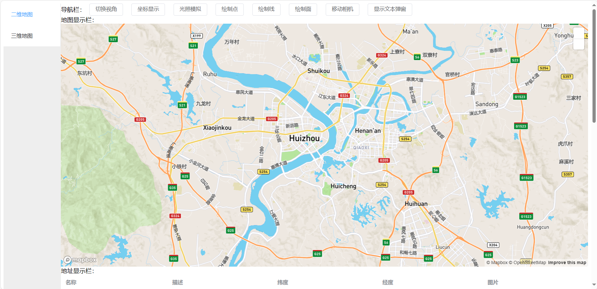
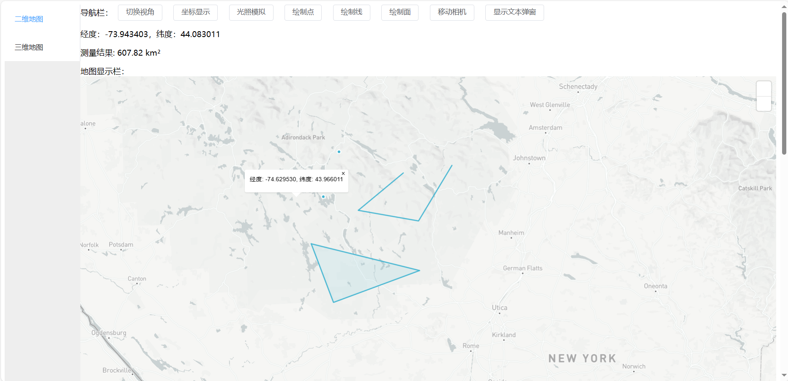
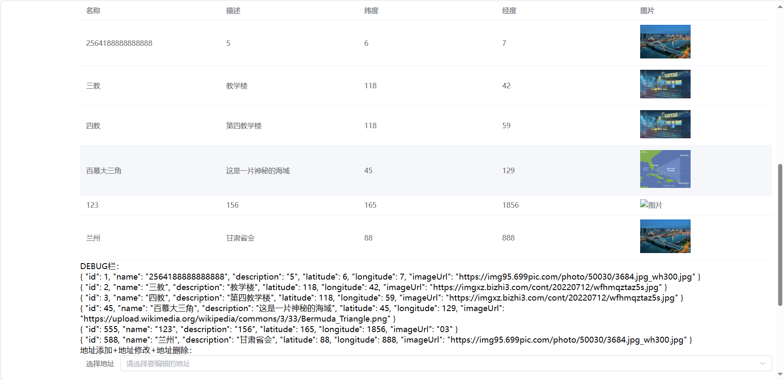
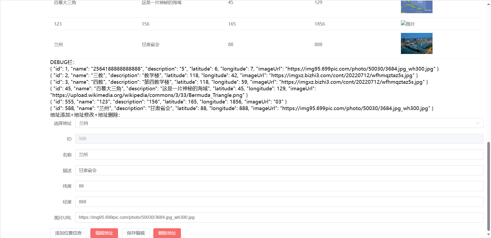

# CUP-2024-软件综合实践
在和我的小伙伴chatGPT4.0以及chatGPT3.5的共同努力下，从不会前端和后端到造出个这么玩意，真不容易
written by erode

## back-end  后端服务
后端使用nodejs搭建
在 back-end 目录下使用以下命令启动后端服务
```shell
node ./server.js
```

## front-end 前端页面
前端使用 Vue3.0 + Element-UI plus搭建 
在 front-end 目录下，运行以下命令启动前端
```shell
npm run serve
```

## 数据库使用 mysql
数据库中只有一个表locations，用来存储保存的位置信息
```mysql
CREATE TABLE `locations` (
`id` INT(10) NOT NULL AUTO_INCREMENT,
`name` VARCHAR(255) NOT NULL DEFAULT '0' COLLATE 'utf8mb4_0900_ai_ci',
`description` TEXT NOT NULL COLLATE 'utf8mb4_0900_ai_ci',
`latitude` FLOAT NOT NULL DEFAULT '0',
`longitude` FLOAT NOT NULL DEFAULT '0',
`imageUrl` VARCHAR(255) NOT NULL DEFAULT '0' COLLATE 'utf8mb4_0900_ai_ci',
PRIMARY KEY (`id`) USING BTREE
```
## 效果展示




